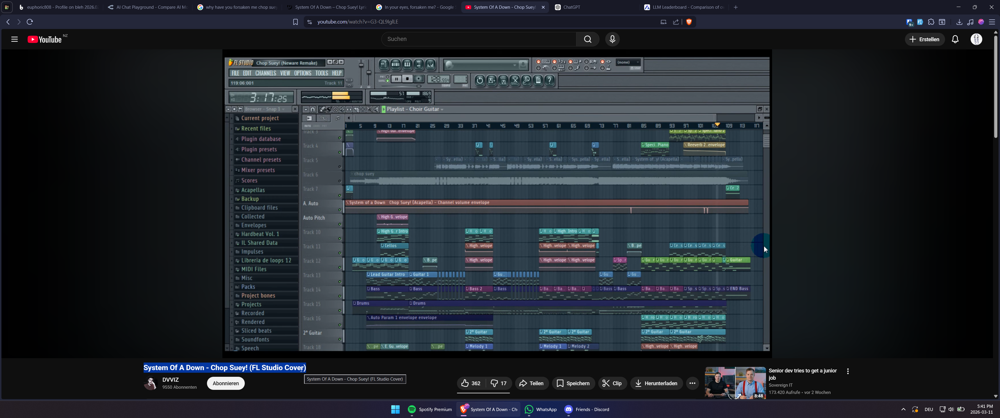

# ai-benchmarks
💡 Some simple AI benchmarks/tests I designed for independently evaluating LLMs and other AI models.

As per usual, nothing in my blog posts (or this specific repository) is written by AI, unless otherwise mentioned.

## Multimodal: Large, Detailed Screenshot to JSON | 🔴 Hard


This PC screenshot of a DAW (Digital Audio Workstation) screen recording on YouTube is very detailed. However, most humans proficient in IT should be able to correctly answer the task stated below with some effort, except for the BPM one, which requires additional DAW/music production knowledge, as well as the Video ID which is very tricky to read, especially due to the low font size.

*Prompt:*

Examine the image and return a completed JSON object based on this template:
    ```{
        "daw_bpm": 0.0,
        "windows_keyboard_language": "",
        "youtube_locale": "",
        "youtube_video_id": "",
        "windows_date": ""
    }
    ```

*Expected response:*

```json
{
    "daw_bpm": 128.554,
    "windows_keyboard_language": "DEU",
    "youtube_locale": "NZ",
    "youtube_video_id": "G3-QL9IglLE",
    "windows_date": "2026-03-11"
}
```

#### Results (2026-03-11, made using OpenRouter)

🧠 = reasoning/thinking enabled | 🕊️ = open weights model | ⚠️ = unusually high values | ✅ only 1 model got the DAW BPM right (twice, that is)

*Cost\*1000* = Average cost per response, all (input, output tokens, etc.) inclusive, multiplied by 1000

| Model                 | Duration (s) | Cost*1000 | DAW BPM | Kbd Lang | YT Locale | Video ID | Date | SCORE/10 |
|-----------------------|--------------|-----------|---------|----------|-----------|----------|------|----------|
| Qwen 3.5 9b 🧠🕊️        | 8.8          | $0.27     | 0/2     | 2/2      | 0/2       | 0/2      | 0/2  | 2        |
| Kimi 2.5 🧠🕊️           | 131 ⚠️        | $15.96 ⚠️  | 0/2     | 2/2      | 0/2       | 0/2      | 1/2  | 3        |
| Qwen 3.5 397B A17B 🧠🕊️ | 95.5 ⚠️       | $16.53 ⚠️  | 0/2     | 2/2      | 1/2       | 0/2      | 0/2  | 3        |
| Qwen 3.5 27b 🧠🕊️       | 6.8          | $2.11     | 0/2     | 2/2      | 0/2       | 0/2      | 2/2  | 4        |
| Gemini 3 Flash        | 0.1          | $0.89     | 0/2     | 2/2      | 2/2       | 0/2      | 0/2  | 4        |
| Gemini 3 Flash 🧠      | 7.8          | $3.57     | 2/2 ✅    | 2/2      | 2/2       | 0/2      | 0/2  | **6**    |
| GPT 5.3 Codex 🧠       | 10           | $12.05 ⚠️  | 0/2     | 2/2      | 2/2       | 0/2      | 2/2  | **6**    |

#### Methodology & Notes

- I used [OpenRouter Chat](https://openrouter.ai/chat) to prompt the LLMs.
- I ran the test twice (thus the n/2 per cell), 1=correct, 0=incorrect
- Gemini, both with and without reasoning, got the closest to the Video ID, with only 1-2 characters off.
- It should be noted that the cost and duration for open source models (Qwen, Kimi) can vary extremely between providers.
- I did not count integer responses as correct for the DAW BPM. My reasoning for that is: in critical infrastructure, just a tiny mistake can be problematic. *Qwen 3.5 397B A17B* got it almost right once but was off by one character. 

#### Key Takeaways
- Even bleeding edge, high-end open weights models (Kimi 2.5, Qwen 3.5 397B A17B) struggle with visual reasoning.
- After  generating 7,100+ (!) tokens, the largest Qwen model with 397 billion parameters only scored 1/5, which is the same as its  9b equivalent.
- I found it suprising that every single LLM could find the Windows keyboard language, but only *Qwen 3.5 27b* and *GPT 5.3 Codex* were able to determine the date consistently, which is in a close proximity to the keyboard language indicator, a similar font size and basically equally readable for most people.
- Personally, I am suprised by *Gemini 3 Flash (Thinking)*'s performance considering its relatively low cost & duration.